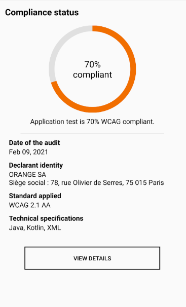

Accessibility-Statement-Library
------

Accessibility Statement Library contains a view showing the WCAG compliance status for its Android application.

To use it, you need the XML accessibility result file from the [Orange va11ydette](https://github.com/Orange-OpenSource/La-Va11ydette)



Import Accessibility Statement lib in your project
------

1. Clone the lib
```
git clone https://gitlab.tech.orange/accessibility-android/accessibility-statement.git
```

2. From your app project opened in Android Studio, navigate to File/Project Structure. Select Modules, click on "Add" button and select "Import Gradle Project".
Choose the previously cloned lib project.

3. Navigate to File/Project Structure. Select Dependencies and click on "Add dependencies" button. Select Module Dependency and select the "Accessibility Statement Lib" module.

Usage
-----
```xml
<com.orange.accessibilitystatementlibrary.StatementView
        android:layout_width="match_parent"
        android:layout_height="wrap_content"
        app:details_url="@string/url"
        app:declarant="@string/declarant"/>
```

* Add the results XML file from the va11ydette in the Assets folder of your project and rename it "accessibility_result.xml"
* Fill in the attribute "app:details_url" with the complete accessibility statement URL of the app
* Fill in the attribute "app:declarant" with the declarant identity of the accessibility statement
